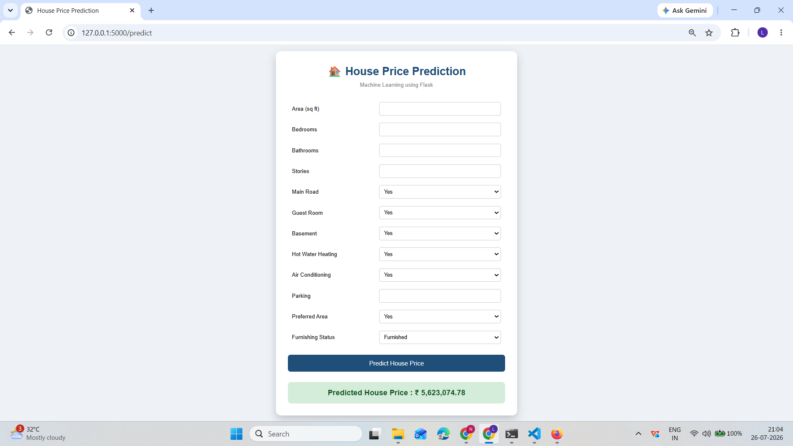

# 🏠 House Price Prediction using Machine Learning

## 📌 Project Overview

This project predicts the selling price of a house based on various property features using Machine Learning. A web application was developed using Flask to allow users to enter house details and receive an estimated house price instantly.

The project follows a complete Machine Learning workflow, including data preprocessing, exploratory data analysis (EDA), model comparison, evaluation, and deployment.

---

## 🎯 Problem Statement

House prices depend on multiple factors such as area, number of bedrooms, bathrooms, parking availability, furnishing status, and location. The objective of this project is to build a machine learning model that accurately predicts house prices based on these features.

---

## 📂 Dataset

**Dataset Name:** Housing.csv

**Number of Records:** 545

**Number of Features:** 13

### Features

| Feature | Description |
|---------|-------------|
| price | House price (Target Variable) |
| area | Area of the house (sq ft) |
| bedrooms | Number of bedrooms |
| bathrooms | Number of bathrooms |
| stories | Number of floors |
| mainroad | Connected to main road (Yes/No) |
| guestroom | Guest room available (Yes/No) |
| basement | Basement available (Yes/No) |
| hotwaterheating | Hot water heating system (Yes/No) |
| airconditioning | Air conditioning available (Yes/No) |
| parking | Number of parking spaces |
| prefarea | Located in preferred area (Yes/No) |
| furnishingstatus | Furnished / Semi-Furnished / Unfurnished |

---

## 🛠 Technologies Used

- Python
- Pandas
- NumPy
- Matplotlib
- Seaborn
- Scikit-learn
- Flask
- HTML
- CSS
- Joblib
- Git
- GitHub

---

## 📊 Machine Learning Workflow

- Data Collection
- Data Loading
- Exploratory Data Analysis (EDA)
- Data Cleaning
- Feature Encoding
- Train-Test Split
- Model Training
- Model Evaluation
- Model Comparison
- Model Selection
- Model Serialization (Joblib)
- Flask Web Application
- GitHub Version Control

---

## 🤖 Machine Learning Models Compared

- Linear Regression
- Decision Tree Regressor
- Random Forest Regressor
- Gradient Boosting Regressor

The models were evaluated using:

- Mean Absolute Error (MAE)
- Root Mean Squared Error (RMSE)
- R² Score

The best-performing model was selected and deployed in the Flask web application.

---

## 📈 Model Evaluation Metrics

- Mean Absolute Error (MAE)
- Mean Squared Error (MSE)
- Root Mean Squared Error (RMSE)
- R² Score

---

## 🌐 Web Application Features

- User-friendly interface
- Real-time house price prediction
- Input validation
- Flask backend
- Responsive HTML & CSS interface

---

## 📁 Project Structure

```text
House-Price-Prediction/
│
├── app.py
├── requirements.txt
├── README.md
├── .gitignore
│
├── model/
│     └── house_price_model.pkl
│
├── data/
│     └── Housing.csv
│
├── templates/
│     └── index.html
│
├── static/
│     └── style.css
│
└── screenshots/
```

---

## 🚀 Installation

### Clone the repository

```bash
git clone https://github.com/YOUR_GITHUB_USERNAME/House-Price-Prediction.git
```

### Navigate to the project

```bash
cd House-Price-Prediction
```

### Install dependencies

```bash
pip install -r requirements.txt
```

### Run the Flask application

```bash
python app.py
```

Open your browser and visit:

```
http://127.0.0.1:5000
```

---

## 📷 Screenshots


### Prediction Result



## 🌐 Live Demo

https://your-project-name.onrender.com

## 🔮 Future Enhancements

- Hyperparameter tuning
- Cross-validation
- XGBoost implementation
- Streamlit deployment
- Cloud deployment
- REST API integration
- User authentication
- Database integration

---

## 👨‍💻 Author

**Nakka Lakshmipathi**

M.Tech (Computer Science)

Aspiring Software Engineer | Machine Learning Enthusiast | Data Analytics Enthusiast

GitHub: https://github.com/NLPathi

LinkedIn: https://www.linkedin.com/in/lakshmipathinakka/

---

## ⭐ If you found this project useful, please consider giving it a star!